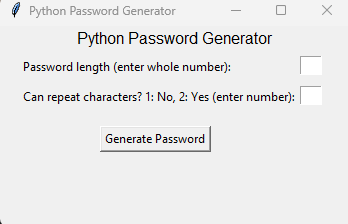
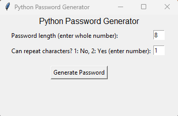

# pythonPasswords

# about

Passwords are the linchpin for many programs to keep your information safe. Generally, the more complex a password, the safer your information. However, many people re-use passwords and only make minor modifications to them. This can compromise the security of the applications we use by putting the authentication process at risk. This python project aims to generate more complex passwords.

# run

This program should not require any extra module installations, since Tkinter should already be build-in. However, if there is a run error, try reinstalling python.

This is the initial screen.

As you can see, there are two inputs:

1. "Password length (enter whole number)"
   This is useful if you require a minimum password length.
2. "Can repeat characters? 1: No, 2: Yes (enter number)"
   Option 1 won't allow repeat characters.
   Option 2 will allow repeat characters.

Select a password length.
For the repeat characters, enter either the number 1 or the number 2.

# additional information

The idea for this project was found on Python Geeks and can be found here: https://pythongeeks.org/python-password-generator/#google_vignette

# future updates

- Connect to MongoDB
  (https://www.mongodb.com/languages/python)
